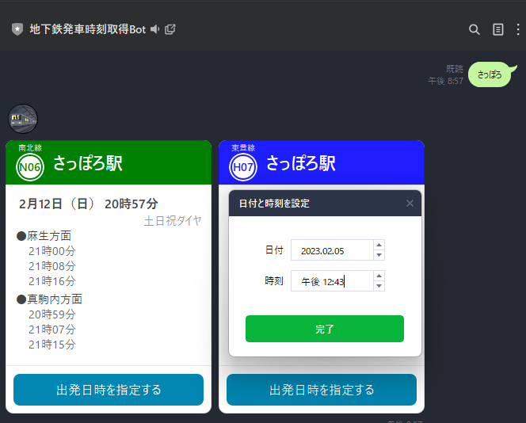
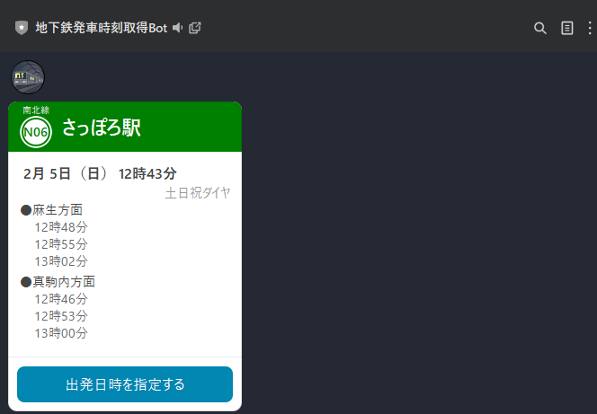

# line-subway-bot

## 1. 概要

札幌市営地下鉄の駅名を入力すると、その駅から何時に列車が発車するかを返信するLineBot。

アカウント：~~@521yoari~~（ホスティング先がなくなったため、現在は停止中）

## 2. 使い方

- 駅名を入力すると、駅を特定し、その駅の列車の発車時間を直近3つ分返信してくれる。

入力する駅名はひらがな（全角／半角）、カタカナ（全角／半角）、漢字に対応
 
一部略称にも対応（例：にーよん → 北24条駅、なんぴら → 南平岸）

また、大通駅やさっぽろ駅など、複数の沿線が通っている駅については、その沿線分結果が表示される。

- 「出発日時を指定する」ボタンを押すと、日時選択フォームが開く。
  日時を選択して送信すると、当該駅について、選択した日時以降で、何時に列車が発車するかを返信する。

## 3. ToDo

- [ ] テストケースの追加
- [ ] 新しいホスティング先を探す
- [ ] 駅、沿線、時刻表情報のDB化
