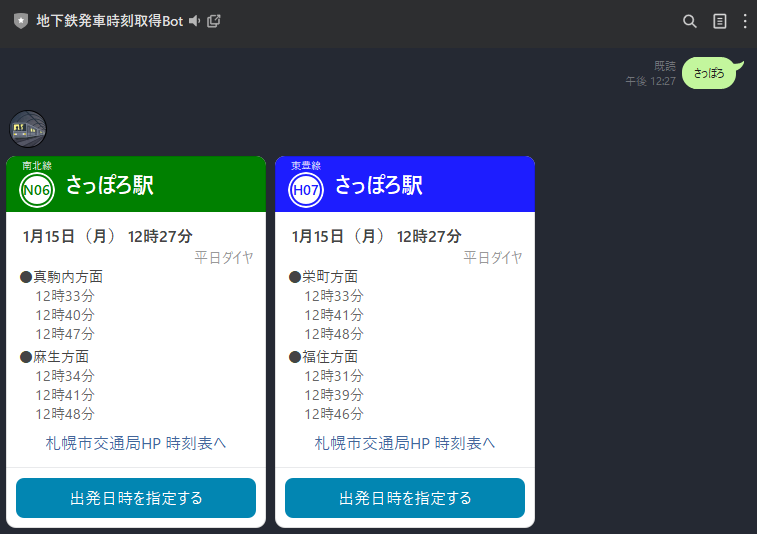
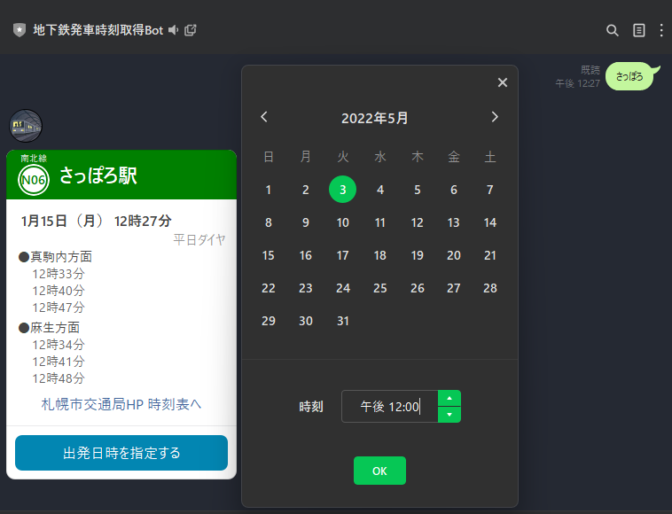
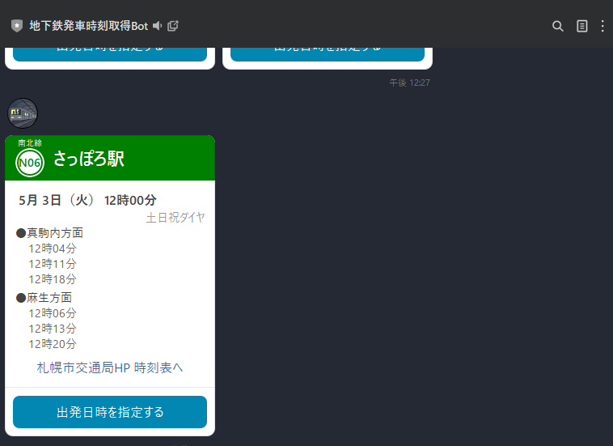

# line-subway-bot

## 1. 概要

札幌市営地下鉄の駅名を入力すると、その駅から何時に電車が発車するかを返信してくれるLINE Botです。

アカウント：~~@521yoari~~（**ホスティング先がなくなったため、現在は停止中**）

### 作成の背景

以下のような経験はないでしょうか？

「もう少し早歩きしていれば、1本前の電車に乗れたのに...」 
「コンビニ寄ってからでも次の電車に間に合ったな...」

このBotを使えば、このようなちょっぴり損した気分(?)を防ぐことができます。

## 2. 使い方

### 駅名から時刻表を検索する

駅名を入力すると、その駅からの電車の発車時刻を直近3つ分返信してくれます。

駅名入力は下記に対応しています。また、「駅」は付けても付けなくても大丈夫です。

- 正式名称（e.g. 琴似駅 → 東西線 琴似駅）
- ひらがな（e.g. まこまない → 南北線 真駒内駅）
- 全角カタカナ／半角ｶﾀｶﾅ（e.g. サカエマチ, ｻｶｴﾏﾁ → 東豊線 栄町駅）
- 一部略称（e.g. さつえき → 南北線 さっぽろ駅 & 東豊線 さっぽろ駅, にーよん → 南北線 北24条駅, なんぴら → 南北線 南平岸）
  - 使用できる略称は[ソース（constants/stations.ts）](https://github.com/antimacho612/subway-line-bot/blob/main/src/constants/stations.ts)の`commonNames`を参照してください

大通駅やさっぽろ駅など、複数の路線が存在する駅については、その路線分時刻表が表示されます。

### 時刻を指定して時刻表を検索する

Botから返信された時刻表メッセージから、その駅について、日時を指定して時刻表を再検索することができます。

## 3. ToDo

- [ ] 新しいホスティング先を探す
